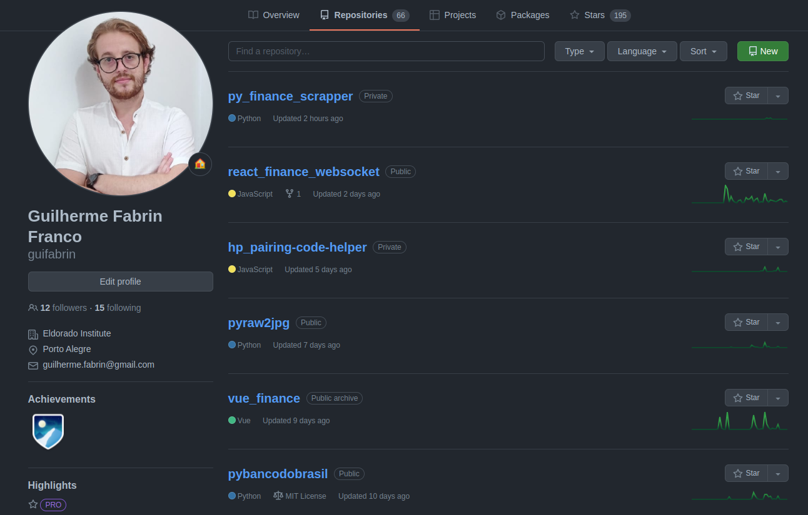

# Mentoria WEB - Módulo 1
Bem-vindo ao primeiro módulo da mentoria WEB!

## Objetivo
- Nosso objetivo com este primeiro passo é compreender a estrutura básica de uma página da WEB compreendendo HTML5, CSS3 e Javascript.
- Constituir uma página WEB utilizando HTML5, CSS3 e Javascript que faça a busca de usuários e liste seus repositórios no Github. 
- Você pode estilizar a sua página do jeito que quiser sem utilizar nenhum framework neste momento, os exemplos apresentados não são mandatórios.

## Git
Faça um fork deste projeto para poder trabalhar com pull requests.

## HTML - Página inicial
Referência [https://developer.mozilla.org/pt-BR/docs/Learn/Getting_started_with_the_web/HTML_basics](https://developer.mozilla.org/pt-BR/docs/Learn/Getting_started_with_the_web/HTML_basics)

Crie uma página inicial como um buscador que contenha apenas um campo para pesquisa do nome de usuário e um botão como no modelo abaixo:

## CSS - Página secundária
Referência [https://developer.mozilla.org/pt-BR/docs/Learn/Getting_started_with_the_web/CSS_basics](https://developer.mozilla.org/pt-BR/docs/Learn/Getting_started_with_the_web/CSS_basics)

Crie uma página secundária que faça a listagem das informações do usuário e os pacotes que ele possuí como no modelo abaixo:

## Javascript - Integração
Referência [https://developer.mozilla.org/pt-BR/docs/Learn/Getting_started_with_the_web/JavaScript_basics](https://developer.mozilla.org/pt-BR/docs/Learn/Getting_started_with_the_web/JavaScript_basics)

Com a utilização do método nativo fetch em Javascript utilize a API do GITHUB https://developer.github.com/v3/ consumindo os seguintes endpoints:
- Endpoint user: https://api.github.com/users/USER_GITHUB
- Endpoint repos: https://api.github.com/users/USER_GITHUB/repos
- Endpoint starred: https://api.github.com/users/USER_GITHUB/starred{/owner}{/repo}

## Dica
- Se utilizar de um formatador de arquivos ou de técnicas de clean code pode ajudar a ter uma visão melhor do seu projeto.

## Fim
- Faça a construção do HTML a partir dos dados aquisitados com o fetch.
- Faça um pull request com o resultado em /docs/<nome.usuario>/modulo_1/